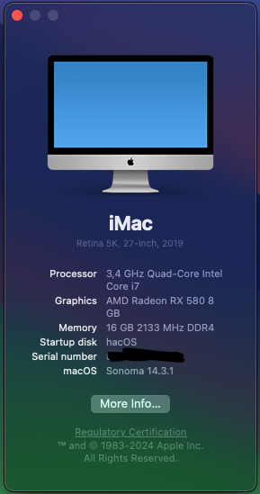
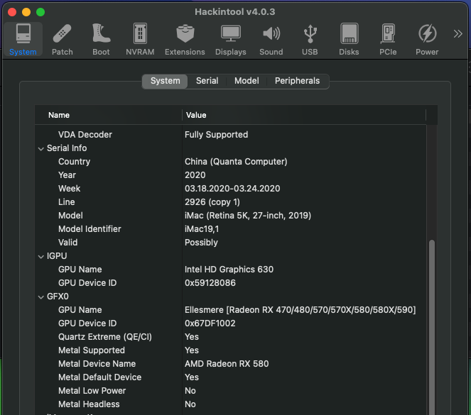

# H110M-R-HACKINTOSH i7-6700 AMD RX 580
<table>
  <tr>
    <td>CPU</td><td>Intel(R) Core(TM) i7-6700 Skylake</td>
  </tr>
  <tr>
    <td>MAIN</td><td>ASUS H110M-R</td>
  </tr>
  <tr>  
    <td>RAM</td><td>DDR4-3200 8GB *2</td>
  </tr>
  <tr>
    <td>iGPU</td><td>Intel HD Graphics 530 1536MB</td>
  </tr>
  <tr>
    <td>dGPU</td><td>MSI AMD Radeon RX580 8GB</td>
  </tr>
  <tr>
    <td>DRM</td><td>Barely functional due to AMD Polaris on Sonoma</td>
  </tr>  
  <tr>
    <td>Audio</td><td>Realtek® ALC887</td>
  </tr>
  <tr>
    <td>Ethernet</td><td>Realtek 8111H LAN Controller</td>
  </tr>  
  <tr>
    <td>OS</td><td>macOS Sonoma 14.x + OpenCore 0.9.8</td>
  </tr>
</table>

# Screenshots

